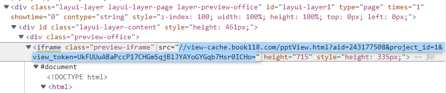

# Book118&docin

使用playwright强力驱动的book118&docin下载工具。

支持范围：book118 doc ppt pdf， docin doc。

## 使用说明

克隆本项目，安装依赖

```
pip install -r requirements.txt

# 安装playwright库
pip install playwright

# 安装浏览器驱动文件（安装过程稍微有点慢）
python3 -m playwright install
```

访问book118网站，点击预览，复制链接，格式如下；

```
https://max.book118.com/html/2017/1105/139064432.shtm
```

以上面的链接为例，在项目文件夹下，使用：

```
# book118
python run.py 'https://max.book118.com/html/2017/1105/139064432.shtm'

python3 run.py 'https://max.book118.com/html/2019/0929/6203012025002111.shtm'
# docin
python run.py 'https://www.docin.com/p-1052644960.html'
```

运行将会在运行目录下生成pdf文档。

如果报错`Image contains an alpha channel which will be stored as a separate soft mask (/SMask) image in PDF.`属于正常现象，不影响最终结果。

### server版

带web界面的版本，开发中。

支持范围：book118 doc， docin doc。

```
pip install -r server.txt

# 安装playwright库
pip install playwright

# 安装浏览器驱动文件（安装过程稍微有点慢）
python3 -m playwright install
```

运行

```
python3 server.py
```

## book118

简介：book118本身是直接将其图片连接放置在了页面元素内，但是存在一个懒加载的问题。即部分图像只有访问到时才会加载，所以这里使用playwright进行模拟访问，等待其加载完毕之后，使用beautifulSoup进行格式化，再利用自带的request进行下载。

进入页面之后，直接下拉完全，再使用sroll语句聚焦到每一个元素等待其懒加载。

由于对于懒加载完成的判定我暂时还没有搞清楚，所以这里完全是使用sleep语句等待加载，使用死循环+try+break，0.5秒钟做一次查询，直到获取链接，所以用的时间可能会比较长。

获取链接之后，使用request包直接下载图片。默认下载到运行目录下。

**使用时请关闭代理！**

之后，再调用img2pdf包，转成pdf文件。

### 关于book118中PPT的处理（在线预览）

Book118中，对于PPT的处理实际上是嵌套了一个iframe元素（可以理解为一个单独的、另外的网页）。所以我们可以直接访问这个网址：

按F12打开开发工具，切到元素，找到iframe，如图所示，双击链接，即可访问PPT放映界面（无广告）




### 关于book118中PPT的处理（下载）

如前所述，对于book118中PPT需要单独对iframe元素做分析。然后在iframe中运行screenshot即可。

由于book118的PPT是动画放映的，为了减少等待时间，也为了减少判定的代码量。这里考虑的是先 下一步 到最后一页，然后再从后往前截图。

> 这里可能有BUG，最后一页可能加载不完全。之后再优化吧。

## docin

docin比book118稍微高级一些，界面包裹着一层鼠标层。里面是很多canvas。使用js动态绘制内容。不过在playwright面前这都不是事。docin默认加载所有页面div，只是canvas需要时间绘制，这里设置的等待时间为0.5秒。可以直接selectall获取所有div，然后一个个div，使用js代码截取canvs内容，转成png，之后和上面一样。

下载docin无需关闭代理。

